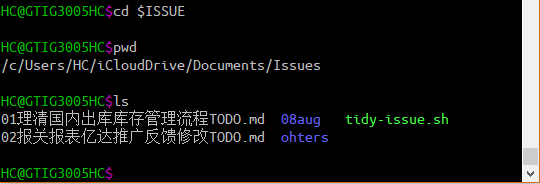

## What is tidy-issue ? ##
tidy-issue是一个shell脚本,用来管理个人ISSUE.结合markdown文件,它将ISSUE的分析处理过程和TODO状态融合:
1. 在文件名中标注TODO状态
2. 文件的内容为ISSUE的分析处理过程

当然你还可以在组织文件内容时将整个ISSUE进一步分解为若干子TODO项.

## Advantages  ##
1. 结构化,轻量(markdown的优点)
2. 跨平台(windows下使用msys2提供shell环境)
3. 随处访问(需借助onedrive,iclouddrive等云盘服务)

## Features ##
1. 新建ISSUE
2. 变更ISSUE状态为DONE
3. 归档状态为DONE的ISSUE到文件夹(按月归档)
4. 重新分配ISSUE的序号

## Usage ##
```
echo "Usage: thisscript [-d] 00-99"
echo "       thisscript ARC | REF"
echo "# 00-99 序号不存在时创建ISSUE并打开,存在时直接打开"
echo "# -d 将指定序号的ISSUE设置为DONE状态"
echo "# ARC 归档状态为DONE的ISSUE(月末归档至文件夹)"
echo "# REF 刷新状态为TODO的ISSUE(月初重新分配序号)"
```

## Screenshots ##

1. 所有ISSUE文件以markdown组织在文件夹Issues中,并且将路径定义为环境变量$ISSUE方便访问
2. 文件夹Issues位于iCloudDrive云盘目录下
3. 所有ISSUE前两个字符为编号(00-99),记录ISSUE的创建的先后顺序
4. 每月利用脚本归档ISSUE到月份文件夹,例如图中文件夹08aug
