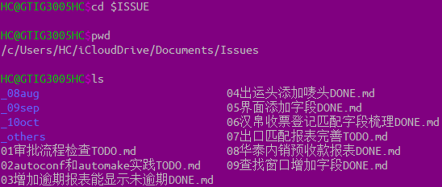

## What is tidy-issue ? ##
tidy-issue是一个shell脚本,用来管理个人ISSUE.结合markdown文件,它将ISSUE的分析处理过程和TODO状态结合:
1. 在文件名中标注TODO状态
2. 文件的内容为ISSUE的分析处理过程
当然你还可以在组织文件内容时将整个ISSUE进一步分解为若干子TODO项.

## Advantages  ##
1. 结构化,轻量(markdown的有点)
2. 跨平台(windows下使用msys2提供shell环境)
3. 随处访问(利用onedrive,iclouddrive等云盘服务)

## Features ##
1. 新建ISSUE
2. 变更ISSUE状态为DONE
3. 归档状态为DONE的ISSUE到文件夹(按月归档)
4. 重新分配ISSUE的序号

## Screenshots ##

1. 所有ISSUE文件以markdown组织在文件夹Issues中,并且将路径定义为环境变量$ISSUE方面访问
2. 文件夹位于云盘软件的管理目录下(这里我用了Apple的iCloudDrive)
3. 所有ISSUE前两个字符为编号(00-99)
4. 每月利用脚本归档ISSUE到月份目录(比如图中的08aug)
